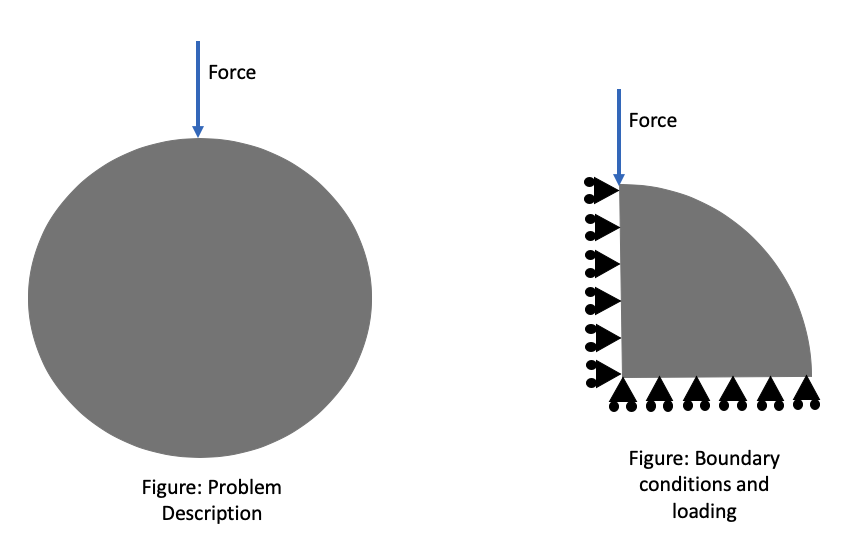

## Shikhar Rai 

This is a FEM course project at University of Rochester. Fall 2019

## Running the code

Download the folder FEM_project and go to FEM_Project/codes folder.

* Run for reduced integraion
    * python main.py --integration reduced --inputDir ../input

* Run for full integraion
    * python main.py --integration full --inputDir ../input

A user defined location for input folder can be given instead of '../input' for inputDir argument.

## Cases
The problem solved here is a planar problem, where a unit point force is applied to a cylinder of unit radius radially at top of the circumference of the cylinder. Because of the symmetry of the problem only a quarter of the problem is solved. The case is a plain strain condtion as the dimension along the axis is very large compared to other direction.

<table>
  <tr>
     <td>
        
         
 Figure: Coarse Mesh</a>

     </td>
     <td>
        
        
 Figure: Fine Mesh</a>

     </td>
  </tr>
</table>

Four cases as following has been documented here:

1. Coarse Mesh Reduced Integration
2. Coarse Mesh Full Integraion
3. Fine Mesh Reduced Integration
4. Fine Mesh Full Integration

Coarse mesh have 11 nodes with 8 elements and fine mesh have 34 nodes with 24 elements. The nodes at x = 0 is fixed in x direction and nodes at y = 0 is fixed in y direction. Load is applied in a single node at positon (x,y) = (0,1). All of the cases have same boundary conditions and loading

## Input format

An input folder location is to be provided in file main.py inside codes folder. The input file should contain files:

| Filename      |              Content               |
|--------------:|:----------------------------------:|
| nodeid.txt    | node id                            |
| coord.txt     | node co-ordinates                  |
| elementid.txt | element id                         |
| elemconn.txt  | 4 nodes connected in each element  |
| matprop.txt   | Material Properties                |
| bc_code.txt   | boundary conditions                |
| loads.txt     | loading conditions                 |

Sample of the input files are in FEM_Project\input folder and FEM_Project\inputCoarse folder for fine and coarse mesh. The lines that start with '%' are the comment lines and are ignored by the code.

## Results of Coarse Mesh Full integration

<figure>
    
    
Figure: Displacement for coarse mesh, Full integration</a>

<figure>
<figure>
    
    
Figure: Stress and Strain for coarse mesh, full integration </a>

<figure>

<figure>
    
    Figure: Y-Reaction at base, full integration 
<figure>