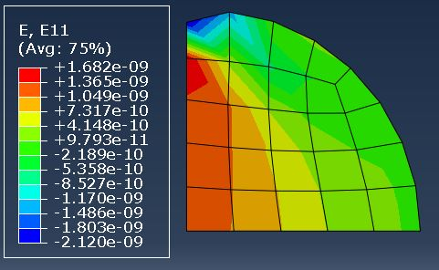
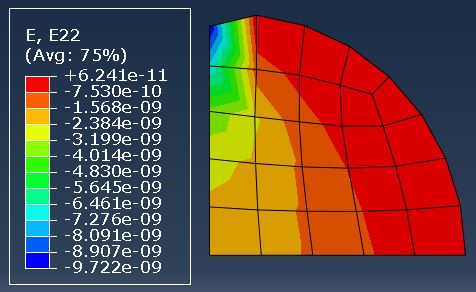
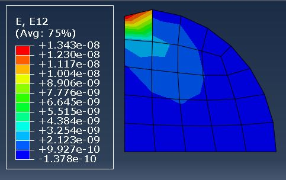
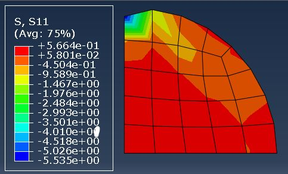
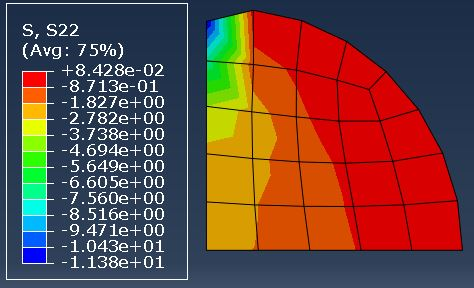
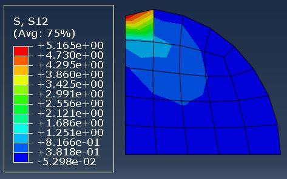

## Shikhar Rai 

This is a FEM course project at University of Rochester. Fall 2019

## Running the code

Download the folder FEM_project and go to FEM_Project/codes folder.

* Run for reduced integraion
    * python main.py --integration reduced --inputDir ../input

* Run for full integraion
    * python main.py --integration full --inputDir ../input

A user defined location for input folder can be given instead of '../input' for inputDir argument.

## Cases
The problem solved here is a planar problem, where a unit point force is applied to a cylinder of unit radius radially at top of the circumference of the cylinder. Because of the symmetry of the problem only a quarter of the problem is solved. The case is a plain strain condtion as the dimension along the axis is very large compared to other direction.

<table>
  <tr>
     <td>
        
         
 Figure: Coarse Mesh</a>

     </td>
     <td>
        
        
 Figure: Fine Mesh</a>

     </td>
  </tr>
</table>

Four cases as following has been documented here:

1. Coarse Mesh Reduced Integration
2. Coarse Mesh Full Integraion
3. Fine Mesh Reduced Integration
4. Fine Mesh Full Integration

Coarse mesh have 11 nodes with 8 elements and fine mesh have 34 nodes with 24 elements. The nodes at x = 0 is fixed in x direction and nodes at y = 0 is fixed in y direction. Load is applied in a single node at positon (x,y) = (0,1). All of the cases have same boundary conditions and loading

## Input format

An input folder location is to be provided in file main.py inside codes folder. The input file should contain files:

| Filename      |              Content               |
|--------------:|:----------------------------------:|
| nodeid.txt    | node id                            |
| coord.txt     | node co-ordinates                  |
| elementid.txt | element id                         |
| elemconn.txt  | 4 nodes connected in each element  |
| matprop.txt   | Material Properties                |
| bc_code.txt   | boundary conditions                |
| loads.txt     | loading conditions                 |

Sample of the input files are in FEM_Project\input folder and FEM_Project\inputCoarse folder for fine and coarse mesh. The lines that start with '%' are the comment lines and are ignored by the code.

## Results of Coarse Mesh Reduced integration

<figure>
    
    
Figure: Displacement for coarse mesh, reduced integration</a>

<figure>
<figure>
    
    
Figure: Stress and Strain for coarse mesh, reduced integration </a>

<figure>

<figure>
    
    Figure: Y-Reaction at base for coarse mesh, reduced integration 
<figure>

## Results of Coarse Mesh Full integration

<figure>
    
    
Figure: Displacement for coarse mesh, Full integration</a>

<figure>
<figure>
    
    
Figure: Stress and Strain for coarse mesh, full integration </a>

<figure>

<figure>
    
    Figure: Y-Reaction at base for coarse mesh, full integration 
<figure>

## Results of Fine Mesh Reduced integration

<figure>
    
    
Figure: Displacement for fine mesh, reduced integration</a>

<figure>
<figure>
    
    
Figure: Stress and Strain for fine mesh, reduced integration </a>

<figure>

<figure>
    
    Figure: Y-Reaction at base for fine mesh, reduced integration 
<figure>

## Results of Fine Mesh Full integration

<figure>
    
    
Figure: Displacement for fine mesh, Full integration</a>

<figure>
<figure>
    
    
Figure: Stress and Strain for fine mesh, full integration </a>

<figure>

<figure>
    
    Figure: Y-Reaction at base for fine mesh, full integration 
<figure> 

## Results from ABAQUS model

<table>
  <tr>
     <td>
        
         
 Figure: Displacement in X-direction </a>

     </td>
     <td>
        
        
 Figure: Displacement in Y- direction</a>

     </td>
     <td>
        
        
 Figure: Displacement magnitude</a>

     </td>
  </tr>
</table>

<table>
  <tr>
     <td>
        
         
 Figure: Strain_xx</a>

     </td>
     <td>
        
        
 Figure: Strain_yy</a>

     </td>
     <td>
        
        
 Figure: Strain_xy</a>

     </td>
  </tr>
</table>

<table>
  <tr>
     <td>
        
         
 Figure: Stress_xx</a>

     </td>
     <td>
        
        
 Figure: Stress_yy</a>

     </td>
     <td>
        
        
 Figure: Stress_xy</a>

     </td>
  </tr>
</table>

<figure>
    
    Figure: Y-Reaction at base for abaqus model
<figure>

The contours of the displacements of the fine mesh is near to the ABAQUS model results, while for stress and strain the contour plot of ABAQUS model is smoother across the elements.

## Discussion

Since our mesh is not pefectly a square aligned with sides aligned with axes the Jacobian matrix is not constant. This results the integrand to be of higher order for and hence reduced integration does not yeild accurate stiffness matrix. Full integration on the other hand yeilds correct stiffness matrix and hence give more accurate results. The spurious displacements in the deformed shape and the Y-reaction magnitude in the base in reduced integration shows the inaccuracy of the results However both reduced and full integration uses Guass Quadrature rule for numerical integraion.

Also, the results in fine mesh yeilds more correct results as the error is minimized in more smaller volume for fine mesh. While the contour are similar we can see the difference of the magnitude of the Y-reaction in the base is higher for coarse mesh than in fine mesh. This is because the reaction forces applied to the lower number of the nodes is needed to balance the applied load. 

One of the ways to improve the result is by decreasing the mesh size. However this is increase the computational cost. Another way to improve the result is by using Q9 element instead of Q4 element. For Q4 element the xx component of strain is only dependent on y co-ordinate and yy component in x co-ordinate and is linear. Using Q9 element will allow us to have stress of higher order and hence can give us more correct results.